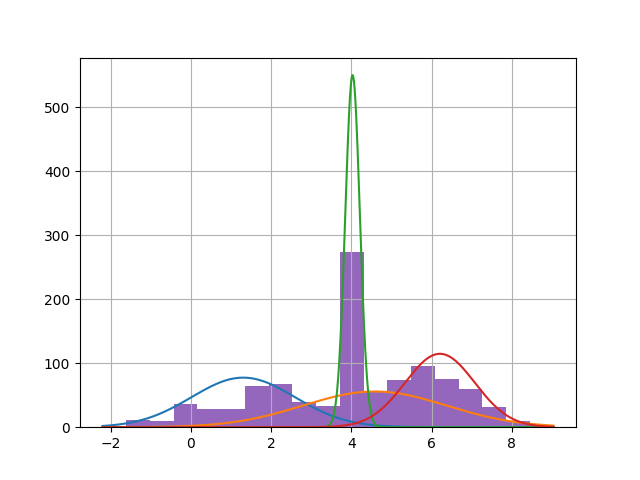
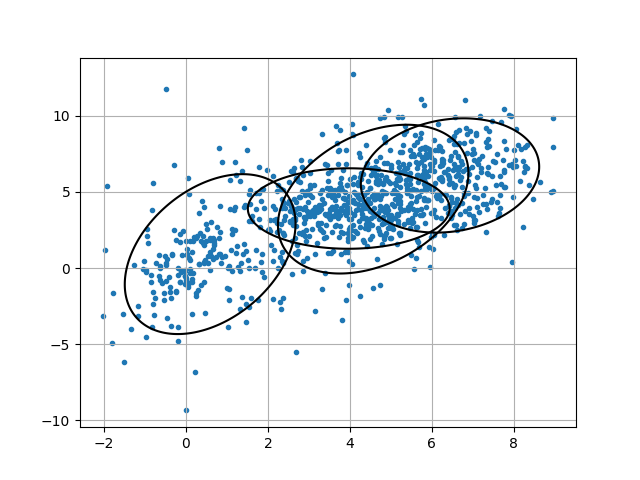

# Expectation-Maximization, Python + Numpy

Python implementation of Expectation-Maximization algorithm, with numpy and scipy

## Example

Simply run ```python3 em.py```. Sample data are generated, and EM is run.

Example1: 1-dimensional, 4-variate normal, with sampling ratio of (0.1, 0.2, 0.3, 0.4) for each distribution



Example2: 2-dimensional, 4-variate normal, with sampling ratio of (0.1, 0.2, 0.3, 0.4) for each distribution

